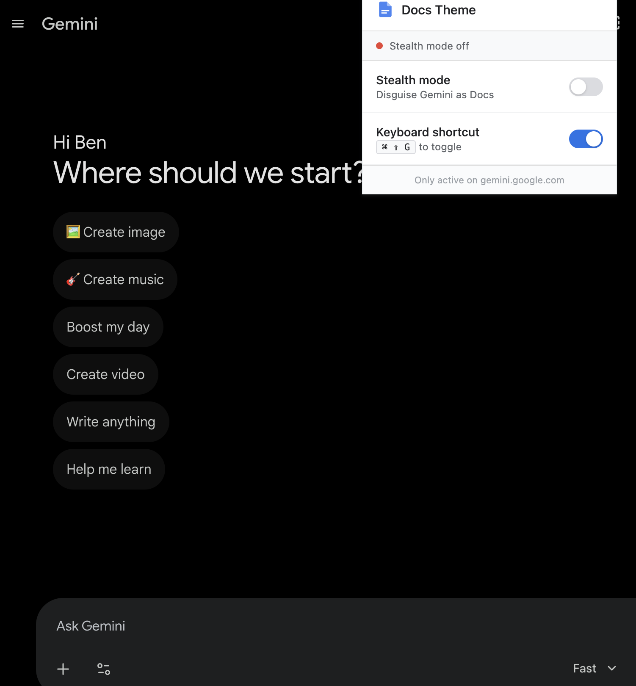
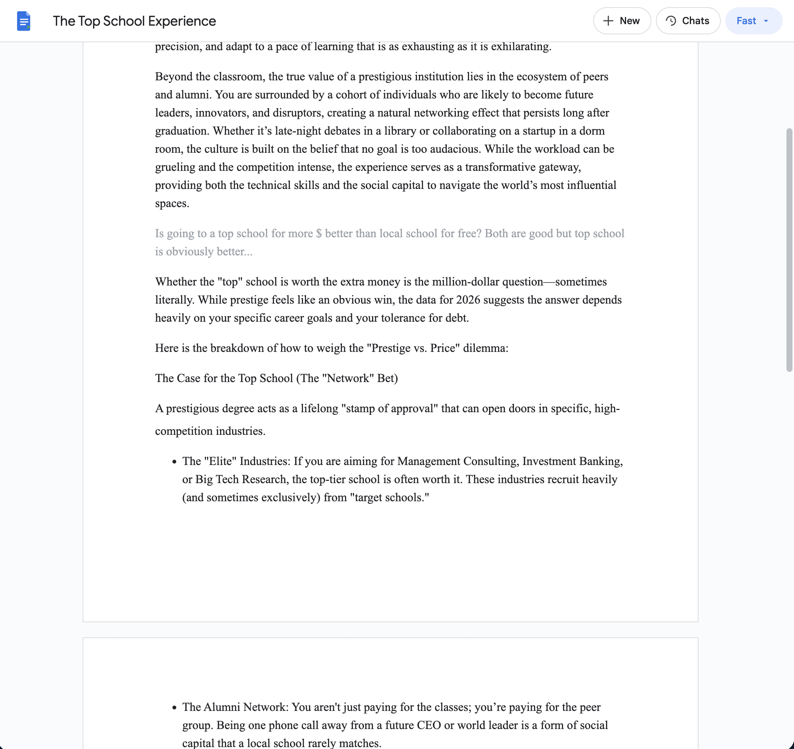
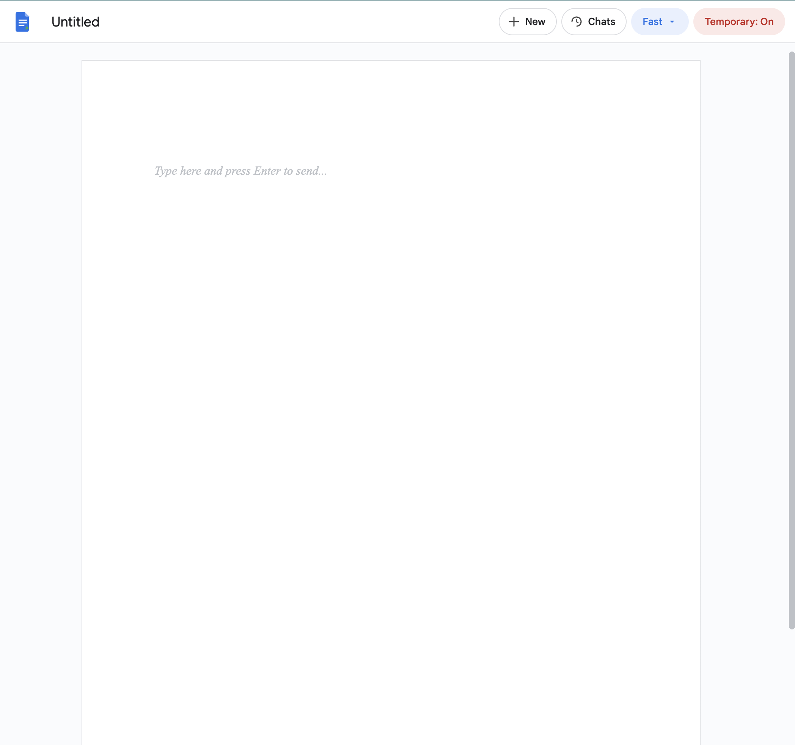
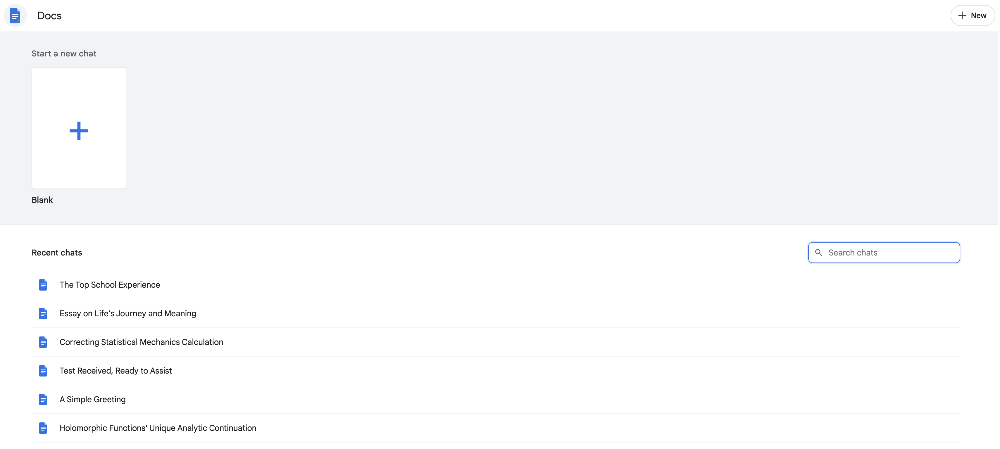
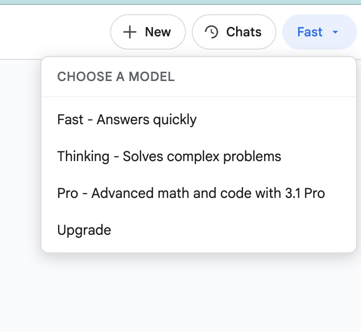

# Gemini Docs Theme

A lightweight Chrome extension that applies a Docs-themed writing interface for `gemini.google.com`.

This is just for fun and obviously not affiliated with Google. 

## Features

- Quick toggle from popup or keyboard shortcut (and scrolling is consistent even through toggling)
- Docs-themed home view with recent chats, search, and blank new-chat card
- Local-only behavior (no external servers or analytics)

## Screenshots

**Switch on stealth view**

---

**Ongoing chat** - View inside a standard chat.

---

**New chat** - View inside a new chat (can toggle temporary chat).

---

**Home** - Can look through old chats and open them. Can use the gemini search chat feature.

---

**Change Model** - Switching Gemini models inside a chat.

